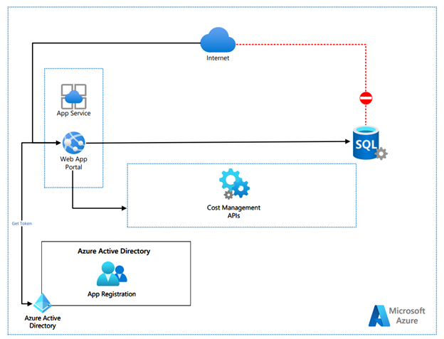
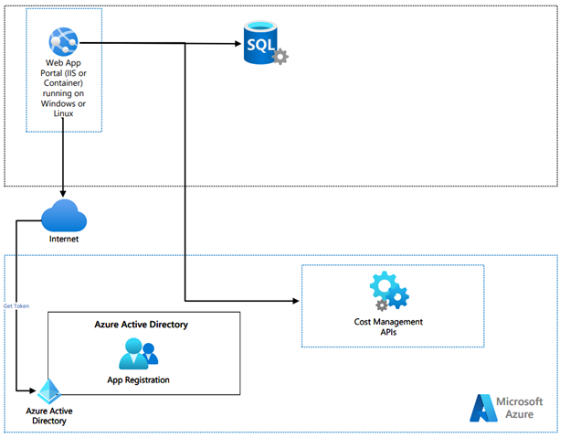

# **Azure Cost Management Dashboard**

The purpose of this document is to detail the central idea of this Azure Cost Management Dashboard, its proposed solution architecture and the infrastructure components needed to install the system in the cloud or on-premises.

## Features

This project framework provides the following features:

* Connect to Cost Management API and get the latest subscription cost (accumulated cost monthly to date)
* Save the data into a SQL Server database
* Provide a Web Dashboard to display the latest 8 days of consumed cost per subscription

In addition to the dashboard, two background mechanisms are implemented that run cost checks and also an alert via email if the current consumption exceeds a configured percentage, for example, 10% or 20 %.

The Dashboard view will be through the website where the app will be installed (cloud or on-premise). The solution does not include a login option to view data.

### Prerequisites

- Visual Studio 2022 (or 2019), or Visual Studio Code
- C#
- JavaScript
- CSS
- HTML
- SQL Server (latest version recommended but not limited to)
- Azure Active Directory (install application to provide access to the subscription via REST API)

### Solution Architecture and Components

Proposed architecture to Cloud

Proposed architecture to on-premises

### Installation

The technologies involved in the solution can be downloaded from the following sources:

Database

- SQL Server Express: [https://www.microsoft.com/pt-br/sql-server/sql-server-downloads](https://www.microsoft.com/pt-br/sql-server/sql-server-downloads) ou
- SQL Server Basic Service Tier can be an option
- Execute scripts inside "infra" folder to create two SQL tables

Application

- .NET 6: [https://dotnet.microsoft.com/en-us/download/dotnet/6.0](https://dotnet.microsoft.com/en-us/download/dotnet/6.0) 

Azure AD

- Register an application into the Microsoft Identity Platform - [https://docs.microsoft.com/en-us/azure/active-directory/develop/quickstart-register-app](https://docs.microsoft.com/en-us/azure/active-directory/develop/quickstart-register-app)
- Add a client secret - [https://docs.microsoft.com/en-us/azure/active-directory/develop/quickstart-register-app#add-a-client-secret](https://docs.microsoft.com/en-us/azure/active-directory/develop/quickstart-register-app#add-a-client-secret)
- Associate a "Reader" role to the subscriptions and include the app created previously [https://docs.microsoft.com/en-us/azure/role-based-access-control/role-assignments-portal?tabs=current](https://docs.microsoft.com/en-us/azure/role-based-access-control/role-assignments-portal?tabs=current)